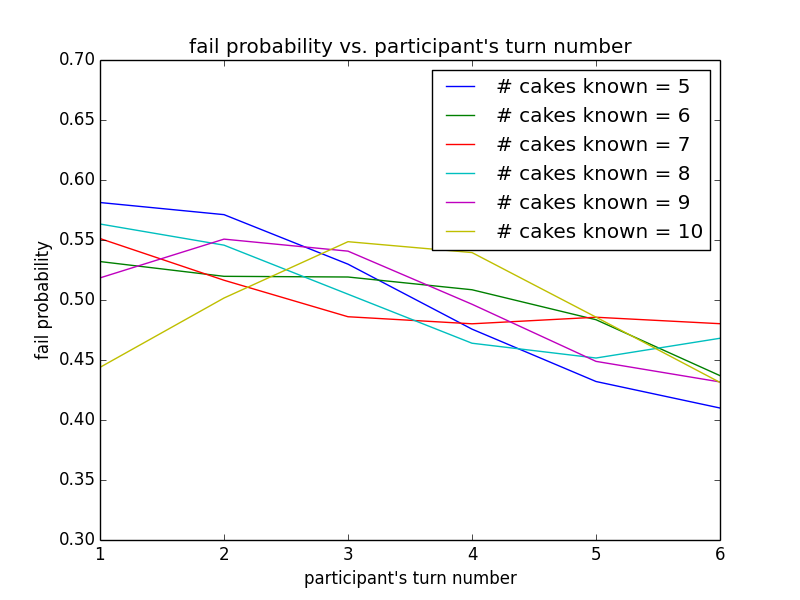

The MasterChef Australia cake elimination test is a test where 6 participants were asked to name a number of cakes that were presented in front of them. The test works as follow: each participant is randomly assigned a number that specifies the order the participant picks and names a cake (i.e. participant #1 starts first, followed by participant #2, #3, ..., #6, and then back to #1); the test finishes when 3 participants failed to name the cake they picked.

The big question: **is the test fair**? That is, if all participants have the same level of skill, does the turn number of the participants give them any unfair advantage or disadvantage? For those who are interested only in the results, please skip to [results](#results).

It is probably possible to work out the probability of a participant failing the test given his/her turn number, but an alternate way of computing it is by simulating the cake elimintation test and repeating it many times (e.g. 100K times) to see how the probabilities converge. In order to simulate the cake elimintation test, we will define several parameters and make a few simplifying assumptions.

### Definition of Equal Skill Level
By skill level we define it as the number of cakes that a participant knows from the presented cakes. Although every participant is assumed to know the same number of cakes (equal skill level), the types of cakes they know could vary. We could simulate this by giving a participant a random set of cakes, but in real life certain cakes are more popular than others, and so we model this using weighted sampling by drawing cakes from a [zipfian distribution](https://en.wikipedia.org/wiki/Zipf%27s_law), where popular cakes are more likely to be drawn than unpopular cakes. In our model, the weight of a participant knowing a cake of a particular rank (rank 1 = most popular cake) is given by 1 / (rank)^p, where p is a parameter. We use p = 0.5 in our model, so the most popular cake (rank 1) has a weight of 1.0 being known, the second most popular cake (rank 2) = 1 / 2^0.5 = 0.71, etc.

It is hard to estimate a reasonable number of cakes that every participant should know. As such, we present results showing a range from 5 to 10. A complete amateur such as myself was able to identify 4-5 cakes so that is probably a good lower bound, and anything beyond 13 or 14 often results in situation where less than 3 participants are eliminated.

### A Binary View of Knowledge
 In real life a participant probably different cakes with various degree of confidence. The simulation simplifies the process by assuming that a participant either knows a cake with 100% confidence or otherwise. When a participant knows no cake in the remaining unnamed cakes, he/she simply chooses a cake (randomly) and fails.
 
### Random Cake Selection
In real life a participant might strategise his/her decision and opt to name more popular cakes first and save unpopular cakes for later rounds. We do not model this --- a participant simply selects a random known cake and names it.

### Summary of Parameters
* Number of Participants = 6
* Number of Participants to Eliminate = 3
* Number of Cakes At the Start = 30
* Number of Cakes Every Participant Knows = 5 to 10
* Number of Trials = 100,000
* Zipfian Distribution Power = 0.5

To run the script: python compute_turn_prob.py

Paramters are given at the top of the script. The script generates a plot and some results summarising mean probability (and standard deviation) for each participant.

Dependencies: python, numpy and matplotlib

# Results

The plot gives the probability of a participant with turn number X failing the test with probability Y for a range of skill levels. Let's call the skill level, i.e. the number of cakes that each participant knows, as C.

In a completely fair game where everyone knows the same number of cakes (noting that the **types** of the cake they know could of course be different), each participant regardless of their turn number should have 50% chance of failing (3/6) for all C values. As we can see from the plot, for C = 5-9, the odds are heavily favoured against the earlier participants (#1 and #2) and heavily favoured for the latter participants (#5 and #6).

|C Values|P#1 Prob|P#2 Prob|P#3 Prob|P#4 Prob|P#5 Prob|P#6 Prob|
|:--:|:---:|:---:|:---:|:---:|:---:|:---:|
|5-9 |0.549|0.541|0.516|0.485|0.460|0.445|
|5-10|0.532|0.534|0.522|0.494|0.465|0.443|

The table gives the probability of a participant failing the test, averaged over a range of C values. It shows that participant #1 and #2 are about 10% more likely to fail compared to Participant #6, even though everyone knows the same number of cakes.

# Conclusion
Is the test completely fair? Most probably not. Although the game doesn't look that much off from a truely fair game --- the deviation of probability is at most 5% from true chance --- it is probably undeniable that the earlier participants are somewhat disadvantaged, and coincidentally the first participant to fail in the test in the show is participant #1 (Matt)...
